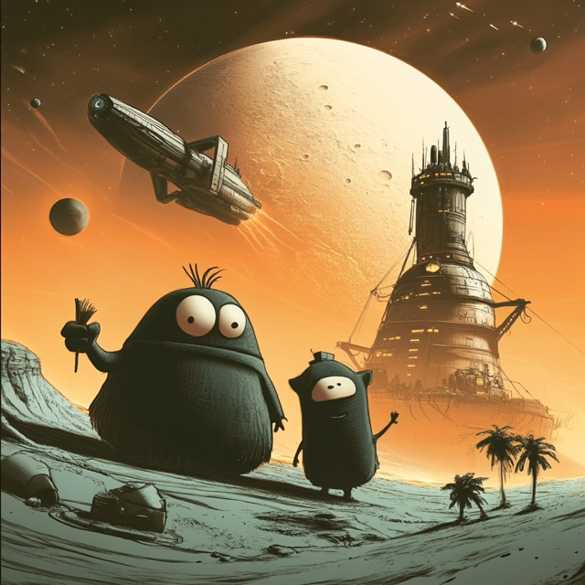
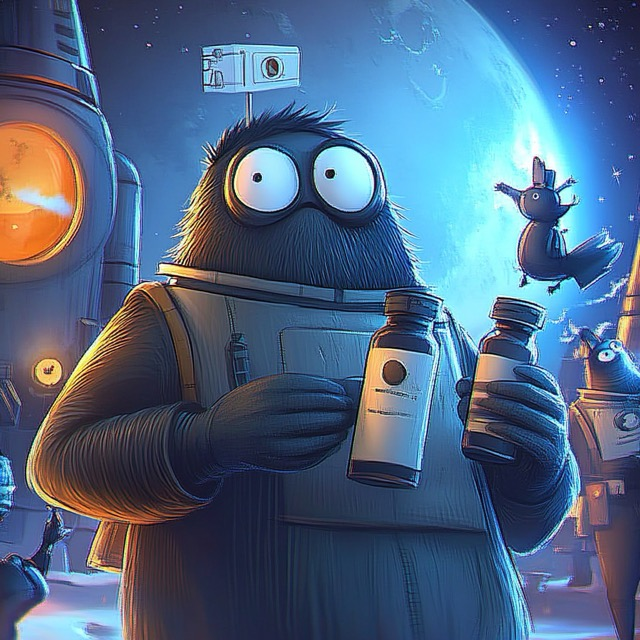

## Game Rule

### The setup
On the long table the player have 23 cards in a line. On center have a same deck of 23 card shuffled.
This is a single player dexterity based table top game. The main goal is get as much score as possible.

### Possible interaction:
- scroll the table left or right stop scrolling the table on second click on same direction
- call a card : try pairing the card which is closest to center. can call a card even if don't see on screen. this call are try to pair a called card with a deck top card.

### Pairing rule:
- Two positive card, you get score if pair odd number with even number
- Two negative card, you get score if pair odd negative number with odd negative number
- If the same positive number paired with negative counterpart then you get a better score
- Zero card can pair with any card. If you call your zero card then over then gameplay.

### Speed of Game
Finally the speed is also important in this game. The final score gaining a further bonus if solve a run under short times!

### Next Release
The next release will be play a multi player version, where the center deck is common. There the timing is bit tricky, but I am working on the perfect solution.




export default Devvit;
```
- [+] `implement the game` a good one.
- [+] Add number to card
- [+] Shuffle the deck
- [+] game rule screen
- [+] test the game
- [-] `make image switch animation` when change scroll direction then change the image.
- [?] Select a proper background images
- [-] make a table where the player can move on 
- [...] connect my program to a `devvit`
  
  - [-] `create content`
  - [-] Try to use a database for something.
  - [-] Make a post message with a image after run.
- [...] New Game without reload
- [+] create how can I play with this game 
- [+] implement `M A R K E R` for info
- [-] create a sage who can tell about Flogons
- [+] create intro : Pitch
- [+] advertise on social platform
- [-] rework spritesheet to percentage

# Flogons on the Bridge!

Flogons on the Bridge! is a chaotic, hilarious social tabletop game where every player is a space trader chasing fame, fortune, or a decent cup of alien tea. Turns? Forget them! Dive into bite-sized mini-games to haggle, smuggle, and gamble your way to glory while everyone else does their thing. Build shady alliances, outwit rivals, or accidentally start intergalactic wars—it’s all in a day’s work. There’s no downtime here—just pure, unhinged cosmic fun!

## Who is the Flogons?
Flogons is a most succesfull space trader in the galaxy.
Their secret skill give a power to reach even the farest place in the universe. Our broader knwoledge is included in this game, after every turn you get a piece of information.

## Moments of Flogons 

Deep Space Mining


Micro Pirates Raid on docking station


Terraform of Ice Moon


Harvesting station


Two Dose



Dream Traveling will starting soon!


I saw a this big ....


Wellness Pod


The right solution is webviews!

## Flogon abilities:
- dream travel with quantum symmetry
- shape change
- item morphose
- limited time survive near any environment
- good sense of humor
- don't waste their time to political influence to each other
- don't use digital money
- avoide the agression because the nightmare is more worst for them

## Card Set

```js
// save
localStorage.setItem('-shoot-', JSON.stringify(shoot));
```

```js
// load
copy(JSON.parse(localStorage.getItem('-shoot-') || '{}'));
```

## - webviews

```js
// simple vite config working well
import { defineConfig } from 'vite';

export default defineConfig({
  build: {
    outDir: 'webroot',
    emptyOutDir: true,
  }
});
```

## Video Generation

Maybe chineese AI video generation will be worth.
[hailuoai](https://hailuoai.video/create)

WOW! that is very impressive!
[Flogons floating in the space](https://hailuoai.video/create/324701351598858241)
[Direct to the video](https://hailuoai.video/share/dOkz0KpoNb3P)

## Devvit

```js
Devvit.addCustomPostType({
  name: '',
  render: context => {}
})
``` 
```js
await redis.hset(myPostId, {[index.toString()]: ....})

await redis.hgetall(myPostId);
```
